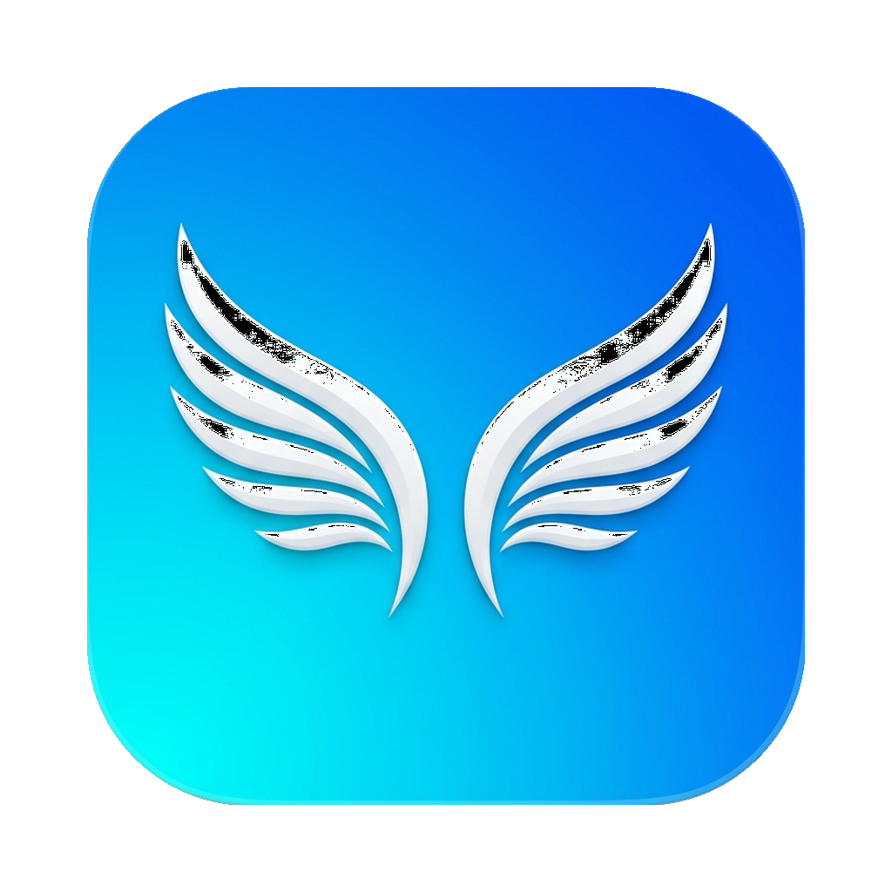

<div align="center">
  
  <h1>云端之翼 (Sky Wings)</h1>
  <p><strong>Claude Desktop 专属增强外挂组件 / 全能工具箱</strong></p>
  <p>基于原生 SwiftUI 打造，兼具 <b>极致的本地汉化体验</b> 与 <b>免代理的本地大模型网关</b>。</p>
</div>

---

## 📖 项目简介
云端之翼 (Sky Wings) 是一款为 Claude 桌面端 (Mac 版) 量身定制的高级系统组件。它采用极致的原生 Apple Minimal UI 设计，旨在解决中文用户在使用 Claude 客户端时面临的两大痛点：**全英文界面的语言壁垒**，以及**苛刻的网络代理要求**。

无论你是想要丝滑的纯中文使用体验，还是想通过本地网关零门槛直连 Nvidia NIM 上的顶级大模型（如 Llama 3.1 405B），只需一键，即可彻底解放你的生产力。

### ☕️ 支持作者 (Buy me a coffee)
如果这个工具为你节省了时间，提升了生产力，欢迎请作者喝杯咖啡！你的支持是我持续维护和优化的最大动力。
<div align="left">
  
</div>

---

## ✨ 核心特性

### 🌍 模块一：环境与无损汉化
打破语言壁垒，深入客户端底层的优雅汉化方案。
- 📦 **一键无损注入**：内置 1.3 万+ 词条的精编中文包。只需一键，即可直接接管官方底层多语言渲染，且不破坏核心源码结构。*(注：受限于官方架构，此方案主要覆盖静态 UI 词条，部分从云端动态下发或硬编码的业务组件仍会保留英文。)*
- 🔄 **官方原版秒切**：自带智能文件指纹对比，支持一键热切换回官方纯正英文原版。
- 🛡️ **门禁绕过与自动重签**：全自动执行底层 `xattr` 隔离属性脱壳与轻量级 `codesign` 本地重签名。彻底告别恶心的“文件已损坏”系统弹窗报错。
- 🔑 **无感钥匙串 (Keychain) 修复**：应用签名变更往往会导致无限输入密码的死循环，本组件会在底层静默抹除旧锁并重新授权，全程无感登录。

### 🧠 模块二：大模型核心网关
免翻墙、免代理，把官方 Claude 变成你的本地开源大模型游乐场。
- ⚡️ **Nvidia NIM 本地协议桥接**：内置高性能、极低内存占用的专属二进制 Go 引擎，将 Claude 标准请求无缝实时（SSE）转换为英伟达接口。
- ☁️ **云端模型动态拉取**：填入 API Key 后，随时动态拉取最新鲜的顶级开源模型（Llama 3.1 405B / Nemotron 等）作为你的 AI 智能体。
- 💉 **一键全局注入配置**：摒弃繁琐的查目录流程，一键将本地网关代理写入 Claude 客户端本地存储库，静默接管 API 请求流。
- 📟 **极客级暗黑控制台**：配置界面下方自带原生实时日志框，网络请求、响应耗时、连接状态一览无余。
- ♻️ **零驻留的强壮生命周期**：严格的端口冲突嗅探（防串台）以及应用生命周期拦截功能。你关闭 Sky Wings 时，后台网关瞬间销毁，绝不产生“僵尸进程”。

---

## 💡 原理解析 (How it works)

### 1. 汉化的核心逻辑 (为什么说是无损？)
传统的 Electron 桌面应用汉化通常需要暴力解包 `app.asar`，这极易导致代码崩溃和后续升级失效。
本工具采用了更优雅的 **“注入式词典替换”** 方案：
- **绕过 ASAR**：我们发现 Claude 的核心语言包暴露在 `Contents/Resources/ion-dist/i18n/en-US.json`。Sky Wings 直接用精心翻译好的 1.3 万词条文件对其进行“偷梁换柱”。
- **修复苹果门禁崩溃**：只要你修改了 Mac 软件的任意内置文件，苹果的 Gatekeeper 就会立刻判定应用被篡改，启动时直接提示“文件已损坏”。为此，本工具在替换词典后，会在底层自动执行 `xattr -cr`（清除隔离属性）和 `codesign`（重新本地签名），完美骗过系统。
- **清除旧锁**：因为签名发生了变化，Mac 系统不再信任这个 App 操作旧的密码库，会导致无限弹窗要求输入密码。我们在最终会执行 `security delete-generic-password` 把旧锁静默拆除，实现完美重生。

### 2. “白嫖”英伟达大模型的逻辑 (偷天换日)
英伟达的 NIM 平台对开发者极其慷慨，提供了包含 Llama 3.1 405B 在内的大量顶级开源模型的**免费调用额度**。但 Claude 桌面端只能识别 Anthropic 自家的接口格式。如何打通？
- **本地欺骗**：当你点击【注入 Claude 配置】时，Sky Wings 会通过 UUID 往 Claude 的本地数据库注入一段配置，骗过 Claude 客户端，让它不再向官方发请求，而是把请求全部拦截并重定向到你在面板上自定义配置的本机端口（如 `http://127.0.0.1:<你设置的端口>`）。
- **协议魔改与伪装**：驻留在本机的 `codex-engine` 接收到 Claude 发来的 Anthropic 格式（`/v1/messages`）的请求后，会将其“拆解、重组、翻译”成通用的 OpenAI 格式，并携带你的 API Key 转发给英伟达云服务器。
- **逆向流式拼装**：英伟达传回的大模型流式数据流，经过网关层再次进行逆向组装，伪装成 Anthropic 的 `content_block_delta` 事件吐回给客户端。
- **最终效果**：客户端以为自己在跟 Claude 3.5 Sonnet 聊天，实际上是在全速白嫖英伟达提供的免费算力，且由于网关在本机，整个过程**完全不需要开启任何代理软件**！

---

## 🚀 安装与使用

### 1. 下载与安装
请直接前往项目的 [GitHub Releases](https://github.com/your-repo/releases) 页面，下载最新版本的 **`Sky Wings.dmg`**。
下载完成后，双击打开 DMG 文件，将 **云端之翼** 图标拖拽至 `Applications`（应用程序）文件夹即可完成安装。

> [!WARNING]
> **遇到“文件已损坏”无法打开怎么办？**
> 由于本项目开源且免费发布，未加入昂贵的 Apple 开发者签名计划。从网络下载并在 Mac 上首次打开时，Gatekeeper 可能会拦截并提示“应用已损坏”。
> **解决方法**：打开「终端」应用 (Terminal)，输入并执行以下命令以解除系统隔离锁定（执行时需要输入你的 Mac 开机密码）：
> ```bash
> sudo xattr -cr "/Applications/Sky Wings.app"
> ```

### 2. 使用指南
1. **获取汉化**：点击顶部的 **“环境与汉化”** 选项卡，按照屏幕提示点击【一键注入汉化补丁】即可。
2. **部署网关**：切换到 **“大模型网关”**，输入你的 Nvidia API Key，挑选想要体验的模型，点击【启动核心网关】，随后点击【注入 Claude 配置】。
3. **极速启动**：环境准备就绪后，直接点击界面上的 **[ 🚀 唤醒 Claude ]** 按钮！享受你的完美定制版客户端。

---

## 🎨 视觉与工程美学
云端之翼 (Sky Wings) 严格遵循了 **Apple Minimal 2026** 的极简设计规范：
- 沉浸式的顶级悬浮分段胶囊导航
- 充满生命力的流光溢彩毛玻璃背景 (`ultraThinMaterial`)
- macOS 极简的无边框流线窗口 (`hiddenTitleBar`)
- 安全和静默的事件流驱动
- UI 主线程 0 卡顿的极致进程调度

**“专注 · 极简”** 是本工具最核心的原则。

---
*声明：本工具仅供学习与本地环境调试使用。修改本地客户端可能受到服务商的相关条款约束。*
